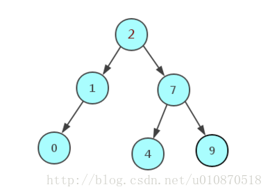
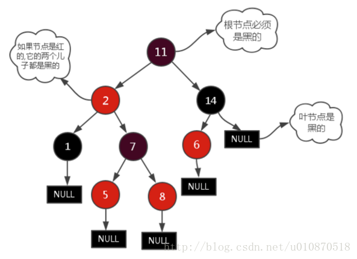
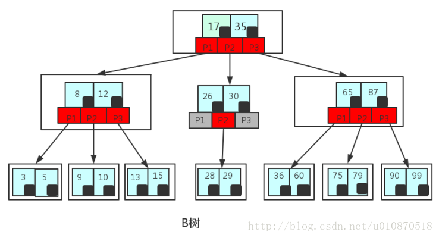
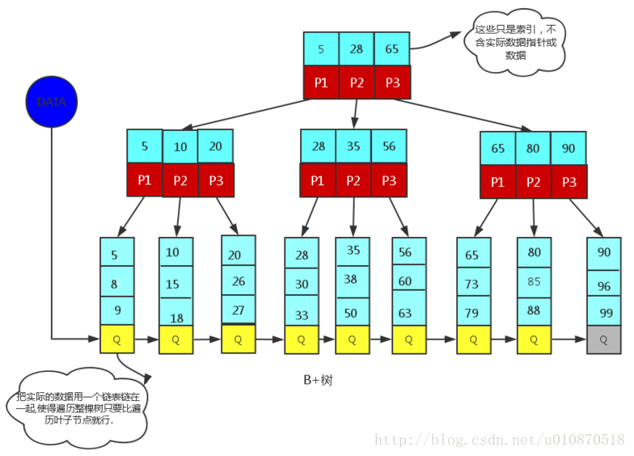

# 数据库索引
> 参考：[AVL树、红黑树、B(B-)树、B+树](https://blog.csdn.net/xlgen157387/article/details/79450295)

> 参考：[为什么数据库索引使用B+树而非红黑树或B-树](https://www.cnblogs.com/aspirant/p/9214485.html)


## AVL树
AVL树是一种强平衡二叉树

产生场景：一般来说，二叉树的平均查找速度会比顺序查询的速度更快，所以二叉树的数据结构适用于查询场景。但是，极端情况下，比如根节点是最小或最大的数，那么二叉树就会退化成线性链路结构，查询速度就和顺序查询差不多。因此，若想构造一个最大性能的二叉查找树，则需设计一颗平衡的二叉树。

AVL树是严格的平衡二叉树（平衡：左右子树树高不超过1）。一般用平衡因子差值判断是否平衡，若不平衡则通过旋转来实现平衡。



局限性：一旦执行插入/删除操作后导致树变得不平衡，就需要通过旋转来保持平衡。而树的旋转是非常耗时的，导致维护这种高度平衡所付出的代价，比从中获得的效益还要大，实际适用场景有限。

AVL树适合于插入/删除次数不频繁，但查询比较多的情况。Windows NT内核中广泛存在AVL树。


## 红黑树
红黑树是一种弱平衡二叉树。每个节点非红即黑，每条路径都包含相同的黑节点数。通过这种对节点着色方式的限制，红黑树确保没有一条路径会比其它路径长出两倍。



相对于严格平衡的AVL树，相同节点下，红黑树的高度更大，但是其旋转次数更少。因此，红黑树适用于搜索、插入、删除操作都比较多的情况下。

红黑树应用：Java的TreeMap实现；C++的Map、Set实现；I/O多路复用epoll的实现等。

## B树（B-树）
B树，也就是B-树，是一种平衡多叉树。

```
B-tree, not to be confused with Binary Tree!

B树，与二叉树无关，B数是多叉树，全称是平衡多路查找树。
```

1. 每个节点可存储多个关键字key（即索引），即每个key对应的数据指针（即数据的实际存储地址）

2. 非叶子结点的关键字个数 = 指向儿子节点的指针个数 - 1

3. B树不允许各个节点中的关键字重复

4. 关键字key在B树中的排序规则如图所示




### **为什么数据库索引使用B类树而非红黑树？**
1. 红黑树(平衡二叉树)为什么不适合用作数据库索引？

索引文件是存储于磁盘中的，因为索引文件通常比较大，无法一次全部加载到内存中。因此，每次只能从磁盘中读取一个磁盘页的数据到内存中。而这个磁盘读取的速度，较内存中数据读取的速度，差了好几个级别。

平衡二叉树结构，指的是逻辑结构上的平衡二叉树，也就是说，逻辑结构上相近的节点，在物理结构上可能会差很远。所以导致每次读取的一个磁盘页数据中有许多是用不上的，从而进一步导致需要进行许多次的磁盘读取操作。

正因为磁盘IO操作非常耗时，所以适合用作数据库索引的结构，应该是可以尽可能地减少磁盘IO操作。因此，红黑树不适合用作数据库索引。


2. 为什么B树适合用作数据库索引？

红黑树没能充分利用磁盘预读功能，而B树则是为了充分利用磁盘预读功能而创建的一种数据结构。也就是说，B树就是为了用作数据库索引才被发明出来的。

> `磁盘预读`：磁盘的存取速度往往只有主存的几百分之一，因此为了提高效率，要尽量减少磁盘I/O。为了达到这个目的，磁盘往往不是严格按需读取，而是每次都会预读。即使只需要一个字节，磁盘也会从这个位置开始，顺序向后读取一定长度的数据放入内存。这样做的理论依据是计算机科学中著名的 `局部性原理：当一个数据被用到时，其附近的数据通常也会马上被使用。`程序运行期间所需要的数据通常比较集中。 由于磁盘顺序读取的效率很高（不需要寻道时间，只需很少的旋转时间），因此预读可以提高I/O效率。

红黑树由于只能二分叉，树高会比较深，逻辑上很近的节点物理上可能很远，因此无法利用局部性原理。也就是说，使用红黑树（平衡二叉树）的话，每次磁盘预读的很多数据是用不上的。因此，它没能利用好磁盘预读功能，同时又由于深度较大（较B树而言），所以进行的磁盘IO操作更多。

B树是为了磁盘或其它存储设备而设计的：1）将B树的一个节点大小设置为一个磁盘页的大小，则可充分利用磁盘预读的功能。即每次读取一个磁盘页时，就会读取一整个节点。2）同时，B树由于是多分叉，每个节点可以存储比较多的关键字，树的深度就会比较小，从而需要执行的磁盘IO操作次数也比较少（更多的是在内存中对读取进来的数据进行查询）。

B树的查询，主要发生在内存中，而红黑树的查询，则主要是磁盘读取。因此，虽然B树的查询次数不比红黑树少，但是相比磁盘IO速度，内存的查询耗时就可以忽略不计了。因此，B树比红黑树更适合作为数据库索引。


## B+树
B+树是B树的变形树，也是一种平衡多叉树。

1. B+树的设计思路，是应文件系统的存储结构而生的。文件系统中，文件目录是一级一级的索引，一直到最底层的文件夹中才保存真正的数据。因此，B+树的非叶子节点只保存索引，不保存实际的数据或指针；实际数据或指针都保存在叶子节点中。换句话说，B+树的非叶子节点仅用作索引，而叶子节点中则包含所有关键字key和key对应的数据或指针。

2. B+树的叶子节点中，有一个指针指向下一个叶子节点。这个设计是为了提高区间访问（范围查询）的性能。

3. 非叶子节点的关键字个数 = 指向儿子节点的指针个数 

4. B+树允许各个节点中的关键字重复

5. 关键字key在B+树中的排序规则如图所示




### `数据库索引使用B+树比B树有什么好处？`


